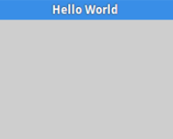

# Informe 
## Análisis de 3 bibliotecas GUI para Python 

## 1.PLANTEAMIENTO DEL PROBLEMA

Analizar 3 bibliotecas GUI(Graphics User Interface) para Python, y utilizar una de estas para implementar una calculadora básica (suma, resta multiplicación, división) y explicar cada una de las funciones empleadas en el programa.

## 2.OBJETIVOS

### General:

Investigar las principales y  más utilizadas librerías GUI para Python, por medio de la abstracción de información, para así poder conocer las funcionalidades que estas tienen y posteriormente dar una explicación a la clase

### Específicos:

Indagar en los buscadores las librerías GUI más utilizadas por los usuarios de internet.

Diseñar y desarrollar el código, e implementar una calculadora básica.

Estructurar la información obtenida como insumo para realizar una exposición ante la clase. 

## 3.ESTADO DEL ARTE

### Tema: Instbio: Librería de Python para simular circuitos electrónicos de instrumentos biomédicos.

Investigadores: Higuera Gonzalez Rogelio Manuel y Martínez García Adriana

Año: 2018

En este trabajo de investigación, se desarrolló e implementó la librería Instbio para observar la respuesta de los circuitos electrónicos que constituyen a los instrumentos biomédicos. Los resultados obtenidos se compararon con resultados experimentales, los cuales confirman que el uso de la librería es eficiente, puesto que los resultados tienen una variación máxima del 6% entre sí.

Lugar: Tecnológico Nacional de México (TECNM), México.

### Tema: Programación de una librería de Python capaz de leer ficheros PDB para representar proteínas en 3D.

Investigadores: Cabrelles Muñoz.

Año:2018

Este proyecto tiene como finalidad el uso de librerías de Python para la visualización de estructuras proteicas tridimensionales mediante el procesado de archivos PDB. Para ello, se utilizaron las herramientas ofrecidas por BioPython para el procesado de datos, y las librerías matplotlib y VisPy para la visualización de los datos procesados. El resultado de este trabajo es un programa cuya interfaz gráfica fue creada mediante la librería Tkinter, que permite la selección del archivo a representar, la selección del motor que se utilizará para la visualización y qué tipo de visualización se generará (CPK, según el tipo de aminoácido al que pertenece, dividido en cadenas, y usando DSSP).

Lugar: Universitat Oberta de Catalunya, España.
 
## 4.MARCO TEÓRICO

### ¿Qué es Gui?

Una GUI es una interfaz de usuario gráfica (en lugar de puramente textual) para una computadora. Al leer cualquier página web o aplicación estás viendo e interactuando con una GUI o la interfaz gráfica de usuario. El término entró en existencia porque las primeras interfaces de usuario interactivas a las computadoras no eran gráficas; estaban orientadas a texto y teclado, y por lo general consistían en comandos que tenía que recordar y las respuestas de la computadora que eran infamemente breves. La interfaz de comandos del sistema operativo DOS que todavía se puede obtener desde su sistema operativo Windows es un ejemplo de la interfaz típica entre usuario y equipo antes de que llegaran las GUI. Un paso intermedio en las interfaces de usuario entre la interfaz de línea de comandos y la interfaz gráfica de usuario era la interfaz basada en menús no gráfica, que le permitía interactuar utilizando un ratón en lugar de tener que escribir comandos del teclado.
La GUI familiar a la mayoría de nosotros hoy, en cualquiera de los sistemas operativos Mac o Windows y sus aplicaciones, se originó en el Laboratorio de Investigación de Xerox Palo Alto, a finales de 1970. Apple lo utilizó en sus primeras computadoras Macintosh. Posteriormente, Microsoft utilizó muchas de las mismas ideas en su primera versión del sistema operativo Windows para PCs compatibles con IBM.(¿Qué Es GUI (Interfaz Gráfica de Usuario) ? - Definición En WhatIs.Com, n.d.)

### ¿Qué es Python?

Python fue creado a finales de los ochenta por Guido van Rossum en el Centro para las Matemáticas y la Informática (CWI, Centrum Wiskunde & Informatica), en los Países Bajos, como un sucesor del lenguaje de programación ABC, capaz de manejar excepciones e interactuar con el sistema operativo Amoeba. El nombre del lenguaje proviene de la afición de un grupo británico de comediantes conocidos como Monty Python. (Python, n.d.)
Python es un lenguaje de programación interpretado el cual hace hincapié en la legibilidad de su código. Se trata de un lenguaje de programación multiparadigma, ya que soporta orientación a objetos, programación imperativa y, en menor medida, programación funcional.
Este lenguaje está administrado por la Python Software Foundation. es una organización sin fines de lucro creada el 6 de marzo de 2001 dedicada al lenguaje de programación Python. Es responsable de varios procesos dentro de la comunidad, como el desarrollo de Python, la administración de los derechos intelectuales y de obtener fondos.(Operadores Python ➞ Explicamos Todos Los Operadores + Ejemplos Reales, n.d.)

Los pasos para comenzar con Python en la programación de una interface de usuario no son terriblemente complejos, pero requiere que el usuario empiece a tomar algunas decisiones. Por su naturaleza como un lenguaje de programación de propósito general con intérpretes disponibles en todos los sistemas operativos comunes, Python tiene que ser bastante agnóstico en cuanto a las opciones que presenta para crear interfaces gráficas de usuario.
Afortunadamente, hay muchas opciones disponibles para los programadores que buscan crear una manera fácil para que los usuarios interactúen con sus programas. Existen enlaces para varios frameworks de interface de usuario en una variedad de plataformas, incluidas las nativas Windows, Mac y Linux, y muchas que funcionan en las tres.
En este punto, tiene que evaluar bien el hecho de necesitar una interface gráfica. Al momento de desarrollar una aplicación, también debe considerar una interface web, especialmente si cree que los usuarios puedan querer alojar su aplicación de forma remota, y proyectos como Django, Flask o Pyramid hacen que esto sea sencillo. Incluso puede usar una librería como pywebview para colocar una capa delgada alrededor de una aplicación web en una ventana GUI más nativa.
O puede utilizar un framework como Pyforms para crear una experiencia coherente en la web, la línea de comandos y el escritorio, todo con una única base de código.
Las tres bibliotecas de las gui:

### WxPython

WxPython le da a un desarrollador una forma de beneficiarse de una biblioteca de GUI multiplataforma, con una licencia clara, al mismo tiempo que brinda los beneficios de Python. Al igual que wxWidgets y Python, wxPython es gratuito y de código abierto, y está disponible para su uso y distribución en proyectos tanto gratuitos como comerciales sin el requisito de distribuir su código fuente (Chazallet, 2015).
Wxpython - Empezando Con Wxpython | Wxpython Tutorial, n.d. dice que: Suite GUI completa que incluye (pero no se limita a): Windows (incluyendo Windows MDI), Magos, Marcos y MiniFrames, diálogos, estándar, avanzado y personalizado, libros, árboles, cuadrículas y controles de vista de datos, tiene indicadores, controles deslizantes, giradores, animaciones, portapapeles, arrastrar y soltar, también tiene compatibilidad con HTML, PDF y visor de imágenes
Los componentes de la GUI se pueden posicionar de forma absoluta, pero se recomienda encarecidamente utilizar un diseño basado en el medidor que admita el tamaño automático, etc.

  *Plataforma cruzada: soporte GUIs para Windows, OS-X y Linux con una base de código única sin declaraciones condicionales en su código
  
  *Velocidad nativa, look & feel.
  
  *Prototipo rápido, prueba y depuración: recuerda que esto es Python.
  
  *Ejecutar y editar muestras de casi todo en el paquete de demostración.
  
  *Licencia clara para uso gratuito incluso en productos comerciales.
  
  *Si es necesario, su GUI de python puede volver a ajustarse a una GUI de WxWidgets de C ++ más adelante, ya que ya la está utilizando.

WxPython nació cuando Robin Dunn necesitaba una GUI que funcionará en sistemas HP-UX y también en Windows 3.1 en unas pocas semanas. Mientras evaluaba las soluciones comerciales, se encontró con unos bindings de Python para el toolkit wxWidgets. Por esto, aprendió Python en un corto tiempo, y se convirtió en uno de los principales desarrolladores de WxPython que se generó a partir de esos bindings iniciales, junto a Harri Pasanen. Las primeras versiones del wrapper fueron creadas a mano. Sin embargo, el código base no tardó en tornarse muy difícil de mantener en sincronización con los releases de wxWidgets. Pero las versiones posteriores fueron creadas con SWIG, reduciendo enormemente la cantidad de trabajo necesario para actualizar el wrapper. La primera versión "moderna" fue anunciada en 1998. A partir del 2011 el código de wxPython fue casi totalmente reescrito en lo que se llamó el proyecto Phoenix. El objetivo principal de este proyecto era automatizar lo máximo posible el desarrollo de los bindings de Python para el tookit wxWidgets, disminuyendo con ello el trabajo necesario para mantener wxPython.2​ Además la nueva versión sería compatible con la versión 3 de Python.
Los aspectos destacados, tenga en cuenta que wxWidgets comprende 100s de clases para el desarrollo de aplicaciones multiplataforma (Wxpython - Empezando Con Wxpython | Wxpython Tutorial, n.d.):

#### Diseño de la ventana usando Sizers

  *Contextos de dispositivos (junto con bolígrafos, pinceles y fuentes)
  
  *Sistema integral de gestión de eventos
  
  *Visor de ayuda HTML
  
*Reproducción de sonido y video

  *Soporte Unicode e Internacionalización.
  
  *Documentar / Ver Arquitectura
  
  *Archiecture de impresión
  
  *Enchufes
  
  *Multihilo
  
  *Manipulación de archivos y directorios
  
  *Ayuda en línea y sensible al contexto
  
  *Procesamiento de HTML
  
  *Contenedores básicos
  
  *Carga de imágenes, guardado, dibujo y manipulación.
  
  *Biblioteca de fecha y hora y temporizadores
  
  *Manejo de errores
  
  *Portapapeles y arrastrar y soltar
  
#### Ejemplo:

  import wx
  
  app = wx.App(redirect=False)
  
  frame = wx.Frame(parent=None, id=wx.ID_ANY, title='Hello World')
  
  frame.Show()
  
  app.MainLoop()
  
Aquí está el resultado: 

### PyQt
PyQt implementa la popular biblioteca Qt, por lo que, si está familiarizado con el desarrollo de Qt en otro idioma, quizás desde el desarrollo de aplicaciones nativas para KDE u otro entorno de escritorio con Qt, es posibles que ya esté familiarizado con Qt. Esto abre la posibilidad de desarrollar aplicaciones en Python que tengan un aspecto familiar en muchas plataformas, al tiempo que aprovechan las herramientas y el conocimiento de la gran comunidad de Qt. (Chazallet, 2015)
PyQt tiene doble licencia bajo licencia comercial y GLP, similar al proyecto Qt en sí, y la compañía principal que brinda soporte a PyQt ofrece una licencia de FAQ para ayudar a entender lo que esto significa para su aplicación. Para otra opción para usar las bibliotecas Qt con Python, considere la posibilidad de verificar PySide, que está disponible bajo LPGL.(PyQt - Wikipedia, La Enciclopedia Libre, n.d.)

#### Ejemplo simple

import sys

 from PyQt5.QtWidgets import QMainWindow, QApplication, QLabel 
 
class VentanaPrincipal(QMainWindow):

    def __init__(self):
    
        QMainWindow.__init__(self)
        
        self.setFixedSize(500, 500)
        
        self.setWindowTitle("Hola mundo")
        
 app = QApplication(sys.argv)
 
ventanita = VentanaPrincipal()

ventanita.show()

sys.exit(app.exec())

#### Aquí está el resultado: 

###  3.   Tkinter
Si hubiera un único paquete que podría denominarse el kit de herramientas GUI “estándar” para Python, sería Tkinter. Tkinter es una envoltura alrededor de Tcl/Tk, una interfaz gráfica popular y el emparejamiento de idiomas que se popularizó por primera vez a principios de los 90. La ventaja de elegir Tkinter es la gran cantidad de recursos, incluidos libros y ejemplos de código, así como una gran comunidad de usuarios que pueden ayudarlo si tiene alguna pregunta. Los ejemplos simples son fáciles de comenzar y bastante legibles para los humanos. Tkinter está disponible bajo la licencia de Python, además de la licencia BSD de Tcl/Tk. (Chazallet, 2015)

#### Ventajas:

Preinstalado con python en casi todas las plataformas

Relativamente simple y fácil de aprender (recomendado para "aprendices")

Documentación completa

#### Desventajas:

Pocos elementos gráficos (sin listas, árboles, etc.)

Limitado control del comportamiento de la interface (recomendado para proyectos "triviales")

Lento (dibuja cada botón, etiqueta, menú, etc.) 

Apariencia "extraña" (no se parece a las aplicaciones nativas) 

#### Ahora vamos a mostrar un pequeño ejemplo de las cosas que se puede hacer en esta librería:

Mokhtar Ebrahim, 2018, dice que Para crear paquete Tkinter y crearemos una ventana y estableceremos su título:

from tkinter import 

window = Tk()

window.title("Welcome to LikeGeeks app")

window.mainloop()

La última línea llama a la función mainloop. Esta función llama al ciclo sin fin de la ventana, por lo que la ventana esperará cualquier interacción del usuario hasta que la cerremos. Si olvidas llamar a la función mainloop, no aparecerá nada al usuario.

#### Para agregar una etiqueta a nuestro ejemplo anterior, crearemos una etiqueta usando la clase label de la siguiente manera:

lbl = Label(window, text="Hello")

#### Para establecer su posición en el formulario utilizando la función grid con su ubicación, de esta manera:

lbl.grid(column=0, row=0)

Y el codigo quedaria asi:

from tkinter import *

window = Tk()

window.title("Welcome to LikeGeeks app")

lbl = Label(window, text="Hello")

lbl.grid(column=0, row=0)

window.mainloop()

#### Si quieres agregar un botón primero:Comencemos agregando un botón a la ventana. El botón se crea y se agrega a la ventana de la misma manera que la etiqueta

btn = Button(window, text="Click Me")

btn.grid(column=1, row=0)

Comencemos agregando un botón a la ventana. El botón se crea y se agrega a la ventana de la misma manera que la etiqueta:

btn = Button(window, text="Click Me")

btn.grid(column=1, row=0)

Entonces, el código de la ventana se verá así:

from tkinter import *

window = Tk()

window.title("Welcome to LikeGeeks app")

window.geometry('350x200')

lbl = Label(window, text="Hello")

lbl.grid(column=0, row=0)

btn = Button(window, text="Click Me")

btn.grid(column=1, row=0)

window.mainloop()

#### Y el resultado se verá así:

Hay que tener en cuenta que colocamos el botón en la segunda columna de la ventana, que es la 1. Si olvidas eso y colocas el botón en la misma columna (en este caso la 0), se mostrará el botón solamente, ya que el botón estará por encima de la etiqueta.

#### Cambiar los colores de fondo y primer plano de un botón.

Puedes cambiar el color de frente del botón o de cualquier otro widget usando la propiedad fg.

También, puedes cambiar el color de fondo de cualquier widget usando la propiedad bg.

btn = Button(window, text="Click Me", bg="orange", fg="red").

Ahora, si trataste de hacer click en el botón, no pasó nada, porque el evento click del botón aún no está programado.

#### Manejar el evento click de un botón

Primero, escribiremos la función que necesitamos ejecutar cuando se haga click en el botón:def clicked():

  	  lbl.configure(text="Button was clicked !!")
     
#### Luego la cableamos con el botón especificando la función de esta manera:

btn = Button(window, text="Click Me", command=clicked)

Fíjate que, escribimos clicked simplement y no clicked() con paréntesis.

#### Ahora el código completo se verá de esta manera:

from tkinter import *

window = Tk()

window.title("Welcome to LikeGeeks app")

window.geometry('350x200')

lbl = Label(window, text="Hello")

lbl.grid(column=0, row=0)

def clicked():

    lbl.configure(text="Button was clicked !!")
    
btn = Button(window, text="Click Me", command=clicked)

btn.grid(column=1, row=0)

window.mainloop()

#### Y cuando hacemos click en el botón, el resultado es el esperado:

#### Entrada de datos usando la clase Entry (Tkinter textbox)

En los ejemplos anteriores de Python GUI, vimos cómo agregar widgets simples, ahora intentemos obtener una entrada del usuario utilizando la clase Tkinter Entry (cuadro de texto de Tkinter).

Puedes crear un cuadro de texto usando la clase Tkinter Entry de esta manera:

txt = Entry(window,width=10)

Luego, puedes agregar el widget a la ventana usando la función grid, como siempre.

Entonces nuestra ventana será así:

from tkinter import *

window = Tk()

window.title("Welcome to LikeGeeks app")

window.geometry('350x200')

lbl = Label(window, text="Hello")
 
lbl.grid(column=0, row=0)

txt = Entry(window,width=10)

txt.grid(column=1, row=0)

def clicked():

    lbl.configure(text="Button was clicked !!")
    
btn = Button(window, text="Click Me", command=clicked)

btn.grid(column=2, row=0)

window.mainloop()

Y el resultado será el siguiente:

Ahora, si haces click en el botón, se mostrará el mismo mensaje anterior. ¿Qué tal si se muestra el texto ingresado en el widget de entrada?
Primero, podemos obtener texto de entrada usando la función get. Entonces podemos escribir este código en nuestra función clicked, de esta manera:
def clicked():

    res = "Welcome to " + txt.get()
    
    lbl.configure(text= res)
    
Si haces click en el botón y hay un texto en el widget de entrada, se mostrará “Welcome to ” concatenado con el texto ingresado.
Y este es el código completo:

from tkinter import *

window = Tk()

window.title("Welcome to LikeGeeks app")

window.geometry('350x200')

lbl = Label(window, text="Hello")

lbl.grid(column=0, row=0)

txt = Entry(window,width=10)

txt.grid(column=1, row=0)

def clicked():

    res = "Welcome to " + txt.get()
    
    lbl.configure(text= res)
    
btn = Button(window, text="Click Me", command=clicked)

btn.grid(column=2, row=0)

window.mainloop()

#### Ejecuta el código anterior y verifica el resultado:

Cada vez que ejecutamos el código, tenemos que hacer click en el widget de entrada para establecer el foco para escribir el texto, ¿qué pasa si configuramos el foco automáticamente?

Establecer el foco en el widget de entrada

Eso es súper fácil, todo lo que tenemos que hacer es llamar a la función focus de esta manera:
txt.focus()

Y cuando ejecutes el código, notarás que el widget de entrada tiene el foco para que puedas escribir el texto de inmediato.

Deshabilitar el widget de entrada

Para deshabilitar el widget de entrada, puedes configurar la propiedad state como deshabilitada (disabled):

txt = Entry(window,width=10, state='disabled')

Ahora, ya no podrás ingresar ningún texto.

#### Agregar un widget combobox

Para agregar un widget combobox, puedes usar la clase Combobox de la librería ttk, de esta manera:

from tkinter.ttk import *

combo = Combobox(window)

Luego puedes agregar los valores al combo.

from tkinter import *

from tkinter.ttk import *

window = Tk()

window.title("Welcome to LikeGeeks app")

window.geometry('350x200')

combo = Combobox(window)

combo['values']= (1, 2, 3, 4, 5, "Text")

combo.current(1) #set the selected item

combo.grid(column=0, row=0)

window.mainloop()

Como puedes ver, agregamos los elementos del combobox usando una tupla de valores. Para configurar el elemento seleccionado, puedes pasar el índice del elemento deseado a la función actual. Para obtener el elemento seleccionado, puedes usar la función get, como se muestra a continuación:

combo.get() 

#### Agregar un widget Checkbutton (Tkinter checkbox)

Para crear un widget Checkbutton, puedes usar la clase Checkbutton de esta manera:

chk = Checkbutton(window, text='Choose')

Además, puedes configurar el estado checked pasando el valor de activación al Checkbutton, de esta manera:

from tkinter import *

from tkinter.ttk import *

window = Tk()

window.title("Welcome to LikeGeeks app")

window.geometry('350x200')

chk_state = BooleanVar()

chk_state.set(True) #set check state

chk = Checkbutton(window, text='Choose', var=chk_state)

chk.grid(column=0, row=0)

window.mainloop()

#### Verifica el resultado:

#### Establecer el estado de un Checkbutton

Aquí creamos una variable de tipo BooleanVar que no es una variable Python estándar, es una variable Tkinter. Luego la pasamos a la clase Checkbutton para establecer el estado de verificación como la línea resaltada en el ejemplo anterior.

Puedes establecer el valor booleano en falso para desactivarlo.

Además, puedes usar IntVar en lugar de BooleanVar y establecer el valor en 0 o 1.

chk_state = IntVar()

chk_state.set(0) #uncheck

chk_state.set(1) #check

#### Agregar widgets radio button
 
Para agregar radio buttons, simplemente puedes usar la clase RadioButton, de esta manera:

rad1 = Radiobutton(window,text='First', value=1)

Ten en cuenta que, debes establecer el valor para cada botón de opción con un valor diferente; de lo contrario, no funcionarán.

from tkinter import *

from tkinter.ttk import *

window = Tk()

window.title("Welcome to LikeGeeks app")

window.geometry('350x200')

rad1 = Radiobutton(window,text='First', value=1)

rad2 = Radiobutton(window,text='Second', value=2)

rad3 = Radiobutton(window,text='Third', value=3)

rad1.grid(column=0, row=0)

rad2.grid(column=1, row=0)

rad3.grid(column=2, row=0)

window.mainloop()

El resultado del código anterior se ve así:

####  Además, puedes configurar el command de cualquiera de estos botones de opción para una función específica, de modo que si el usuario hace click en alguno de ellos, ejecuta el código de la función asignada.

Aquí un ejemplo:

rad1 = Radiobutton(window,text='First', value=1, command=clicked)
def clicked():

#### Obtener el valor del radio button (opción seleccionada)

Para obtener el botón de opción actualmente seleccionado o el valor del botón de opción, puedes pasar un parámetro variable a los botones de opción y más adelante puede obtener 

su valor.from tkinter import *

from tkinter.ttk import *

window = Tk()

window.title("Welcome to LikeGeeks app")

selected = IntVar()

rad1 = Radiobutton(window,text='First', value=1, variable=selected)

rad2 = Radiobutton(window,text='Second', value=2, variable=selected)

rad3 = Radiobutton(window,text='Third', value=3, variable=selected)

def clicked():

   print(selected.get())
   
btn = Button(window, text="Click Me", command=clicked)

rad1.grid(column=0, row=0)

rad2.grid(column=1, row=0)

rad3.grid(column=2, row=0)

btn.grid(column=3, row=0)

window.mainloop()

Cada vez que seleccione un botón de opción, el valor de la variable cambiará al valor de la opción seleccionada.
 
## 5. LISTA DE COMPONENTES
 
## 6. MAPA DE VARIABLES

 

## 7. APORTACIONES

PyQt si está desarrollando algo serio, esto quiere decir a un programa más grande como el de estar realizando proces 24 horas o a tiempo real. Especialmente si las cosas que aprende se traducirán directamente a trabajar con Qt en otros idiomas si es necesario, y Qt es probablemente el mejor kit de herramientas de interfaz multiplataforma disponible en este momento.

Solo hay dos desventajas reales (potenciales):

PyQt solo está disponible bajo la GPL. Esto significa que si libera su código, debe estar disponible bajo una licencia compatible, en los términos de Excepción GPL de Nokia , o bajo una licencia comercial la cual cuesta. Esto contrasta con Qt, que ahora está disponible bajo la licencia LGPL.

PyQt no se incluye de forma predeterminada con las instalaciones de Python. Vas a tener que empaquetar la biblioteca tú mismo. (Ars Technica tiene un buen artículo sobre cómo hacerlo para Windows y OS X.)

### Una aporte adicional sería construir una calculadora científica. 

El código fuente se encuentra en el anexo 1. 

 
## 8. CONCLUSIONES

Se pudo modificar un algoritmo en lenguaje de programación Python el cual nos permite realizar las 4 operaciones básicas.
 
Tkinter es excelente para aplicaciones GUI pequeñas y rápidas, y dado que se ejecuta en más plataformas que cualquier otro kit de herramientas GUI de Python, es una buena opción donde la portabilidad es la principal preocupación.

 
## 9. RECOMENDACIONES
 
## 10. CRONOGRAMA

 
## 11. BIBLIOGRAFÍA:

(Wxpython - Empezando Con Wxpython | Wxpython Tutorial, n.d.)¿Qué es GUI (interfaz gráfica de usuario) ? - Definición en WhatIs.com. (n.d.). Retrieved July 18, 2020, from https://searchdatacenter.techtarget.com/es/definicion/GUI-interfaz-grafica-de-usuario

Chazallet, S. (2015). Python 3 Los fundametos del lenguaje. https://www.ediciones-eni.com/open/mediabook.aspx?idR=9103588b3f4c184b8f2497bcf75605a9

Fatima, H. (2017). The 6 Best Python GUI Frameworks for Developers. https://blog.resellerclub.com/the-6-best-python-gui-frameworks-for-developer/

Mokhtar Ebrahim. (2018, January 22). Ejemplos de la GUI de Python (Tutorial de Tkinter) - Like Geeks. https://likegeeks.com/es/ejemplos-de-la-gui-de-python/

Operadores Python ➞ Explicamos todos los operadores + Ejemplos reales. (n.d.). Retrieved July 18, 2020, from https://pythones.net/operadores-basicos-en-python/

PyQt - Wikipedia, la enciclopedia libre. (n.d.). Retrieved July 18, 2020, from https://es.wikipedia.org/wiki/PyQt

Python. (n.d.). python.org. Retrieved July 18, 2020, from https://es.wikipedia.org/wiki/Python#:~:text=Python es un lenguaje de,en menor medida%2C programación funcional.
wxpython - Empezando con wxpython | wxpython Tutorial. (n.d.). Retrieved July 19, 2020, from https://riptutorial.com/es/wxpython
 
 
 
## 12. ANEXOS

